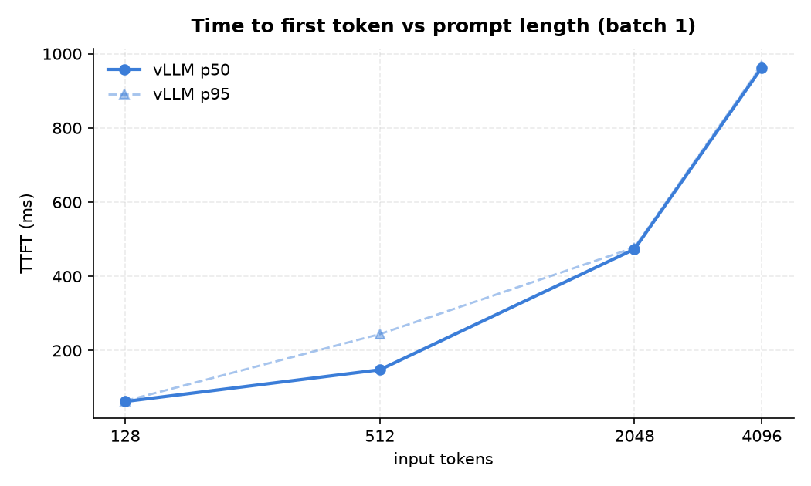
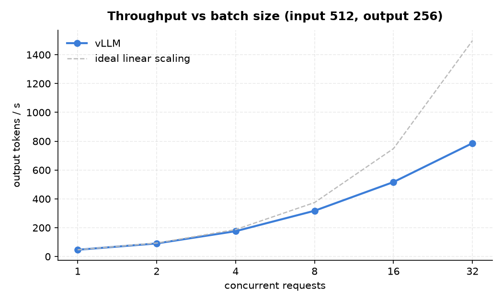
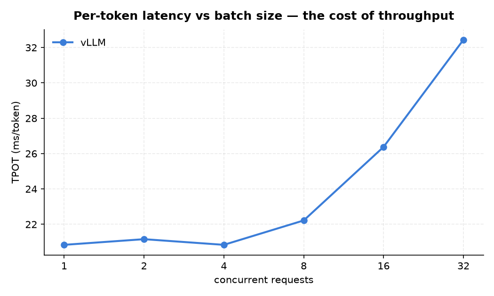

# LLM Inference Benchmarks — RTX 3090

Reproducible latency/throughput measurements for LLM serving engines on a single
consumer GPU, with every number cross-checked against a first-principles roofline.

**Headline result: measured performance lands within 84–98% of the hardware ceiling,
and the two serving phases are limited by *different* physical resources.**

| Phase | Bound by | Theoretical | Measured | Efficiency |
|---|---|---|---|---|
| Decode (batch 1) | memory bandwidth | 17.50 ms/token | 20.84 ms/token | **84%** |
| Prefill (4096 tok) | compute | 945 ms | 962.8 ms | **98%** |

---

## Setup

| | |
|---|---|
| GPU | NVIDIA RTX 3090, 24 GB GDDR6X — 936 GB/s, 71 TFLOPS FP16 (FP32 accumulate) |
| Driver | 610.62 (WSL2, kernel 6.6.87.2) |
| Model | `Qwen/Qwen3-8B` — 36 layers, 32 attention heads, 8 KV heads (GQA), head_dim 128 |
| Precision | BF16 (no quantization) |
| Engine | vLLM 0.27.1 · PyTorch 2.13.0+cu130 |
| Serving | `--max-model-len 8192 --gpu-memory-utilization 0.90 --no-enable-prefix-caching` |

**KV cache budget:** weights consume ~15.3 GiB, leaving **5.9 GiB = 42,976 tokens** of KV cache.
At 144 KB/token this model is 2.6× more cache-hungry than Qwen2.5-7B (56 KB/token) — its GQA
ratio is 4:1 rather than 7:1. That single number dictates how far the batch sweep can go.

## Method

One engine-agnostic client (`bench_client.py`) drives any OpenAI-compatible endpoint over
streaming HTTP, so different engines are exercised by identical code and identical prompts.

- **3 warmup bursts** discarded, then **5 measured bursts** per configuration
- Reports **p50 and p95**, never bare averages
- `temperature=0`, `ignore_eos=true` — every request emits exactly 256 tokens
- Peak VRAM sampled at 4 Hz in a background thread
- **One dimension varies at a time.** A batch × context cartesian product would OOM at the
  corners and would confound the two effects anyway.

```bash
# latency: batch fixed at 1, prompt length swept
# throughput: prompt fixed at 512, concurrency swept
python bench_client.py --engine vllm --base-url http://127.0.0.1:8000/v1 \
    --model qwen3-8b --tokenizer ~/models/qwen3-8b --out results_vllm.json
python make_charts.py results_vllm.json --outdir charts/
```

---

## Results

### Prefill is compute-bound



| prompt tokens | TTFT p50 | TTFT p95 |
|---:|---:|---:|
| 128 | 62.5 ms | — |
| 512 | 148.1 ms | — |
| 2048 | 473.2 ms | — |
| 4096 | 962.8 ms | — |

TTFT scales close to linearly with prompt length, which is what a compute-bound phase looks
like: prefill does `2 × P × N` FLOPs, so doubling the prompt doubles the work.

Predicted from the roofline: `2 × 8.19e9 × 4096 / 71e12 = 945 ms`. Measured **962.8 ms** —
the engine is running prefill at **98% of what the silicon can do**. There is essentially no
headroom here; the only way to cut TTFT on this hardware is to do less work (shorter prompts,
prefix caching, chunked prefill).

### Decode is memory-bound

Per-token latency stays flat at ~21 ms regardless of prompt length, because decode re-reads
the entire weight matrix for every token and that dominates everything else.

Predicted: `16.38 GB / 936 GB/s = 17.50 ms`. Measured **20.84 ms → 84% of the bandwidth roofline**.
The 16% gap is kernel launch overhead, sampling, and the attention work the simple model ignores.

**This is why quantization matters far more than raw FLOPs for single-stream generation.**
Halving the weight bytes would nearly halve decode latency; adding compute would do nothing.

### Batching trades latency for throughput




| concurrency | throughput | TPOT p50 | TTFT p50 |
|---:|---:|---:|---:|
| 1 | 46.8 tok/s | 20.84 ms | 144.3 ms |
| 2 | 90.9 tok/s | 21.16 ms | 214.3 ms |
| 4 | 175.8 tok/s | 20.84 ms | 494.5 ms |
| 8 | 317.5 tok/s | 22.22 ms | 749.6 ms |
| 16 | 516.9 tok/s | 26.38 ms | 1119.2 ms |
| 32 | **786.6 tok/s** | 32.44 ms | 2039.9 ms |

32× the concurrency buys **16.8× the throughput** for a 56% increase in per-token latency —
the weights are read once per step and amortized across every request in flight.

Scaling stays near-linear to batch 4 and then bends. That inflection is where prefill work
from arriving requests starts competing with decode for the same SMs: TTFT degrades 14×
across the sweep while TPOT only degrades 1.6×.

**The knee is a serving decision, not a hardware limit.** Latency-sensitive workloads should
cap concurrency around 4–8; batch/offline workloads should push to 32+ and accept 2-second TTFT.

---

## What went wrong first (and how we caught it)

The first run reported TTFT of **42 ms at a 4096-token prompt**. The roofline says prefill
alone must cost ~945 ms. A 20× discrepancy is never a pleasant surprise — it means the
measurement is wrong, not that the engine is magic.

Cause: the harness reused one fixed prompt across all requests, so vLLM's automatic prefix
caching served prefill straight from cache. The server log confirmed it — `Prefix cache hit
rate: 75.3%`.

Two fixes, both applied:
1. Every request now gets a UUID-prefixed prompt, so no two share a prefix.
2. The server runs with `--no-enable-prefix-caching`, so the engine's raw cost is measured.

Decode numbers were unaffected (generation does real work either way), but every TTFT figure
in the first run was measuring a cache lookup.

**Takeaway: compute the expected value before trusting a measured one.** The roofline was not
decoration — it was the thing that caught the bug.

Side effect worth noting: disabling prefix caching *increased* usable KV cache from
4.91 GiB to 5.9 GiB, since the engine no longer reserves a cache region.

## Running vLLM under WSL2

Out of the box it fails three times. All three are environment issues, not vLLM bugs:

```bash
VLLM_WSL2_ENABLE_PIN_MEMORY=1 \
VLLM_USE_DEEP_GEMM=0 VLLM_MOE_USE_DEEP_GEMM=0 \
VLLM_USE_FLASHINFER_SAMPLER=0 \
vllm serve ...
```

1. `RuntimeError: UVA is not available` — misleading. UVA *is* available
   (`cudaDevAttrUnifiedAddressing = 1`, pinned allocation succeeds). vLLM disables pinned
   memory on WSL by default and gates it behind `VLLM_WSL2_ENABLE_PIN_MEMORY`.
2. `Could not find nvcc` — `deep_gemm` JIT-compiles kernels. No CUDA toolkit in this WSL image.
3. The same nvcc error again, this time from FlashInfer's sampling kernel. Greedy decoding
   does not need it.

---

## Files

```
bench_client.py     engine-agnostic measurement harness
make_charts.py      chart generation
results_vllm.json   raw measurements (p50/p95 per configuration)
charts/             generated figures
```

## Next

TensorRT-LLM measured with the same harness and the same prompts, for a like-for-like
comparison of an ahead-of-time-compiled engine against a dynamic one. The interesting
question is not which is faster overall, but where each wins: TensorRT-LLM builds a fixed
engine per configuration, while vLLM keeps scheduling flexibility at runtime.
