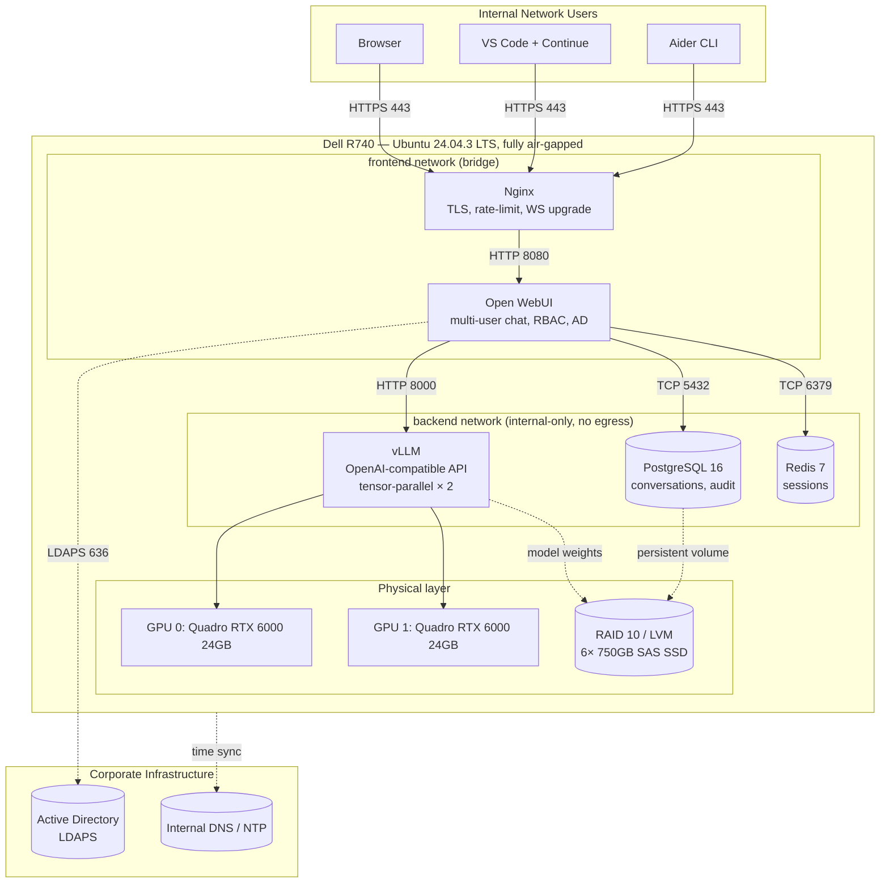
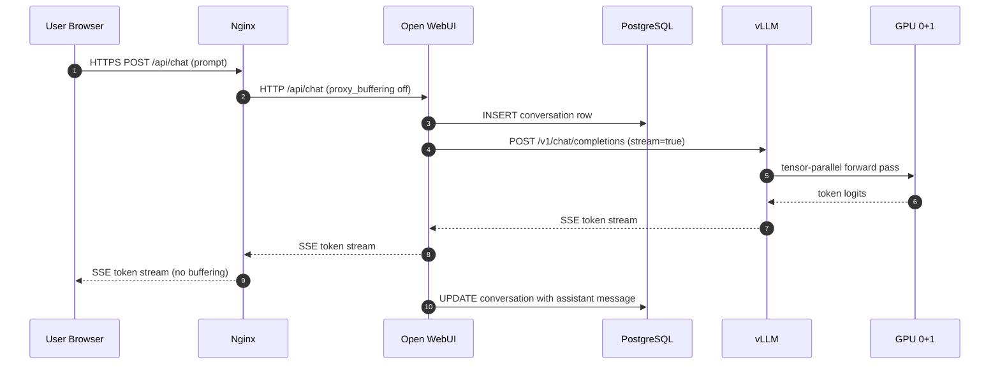
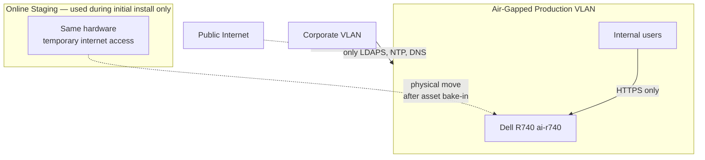
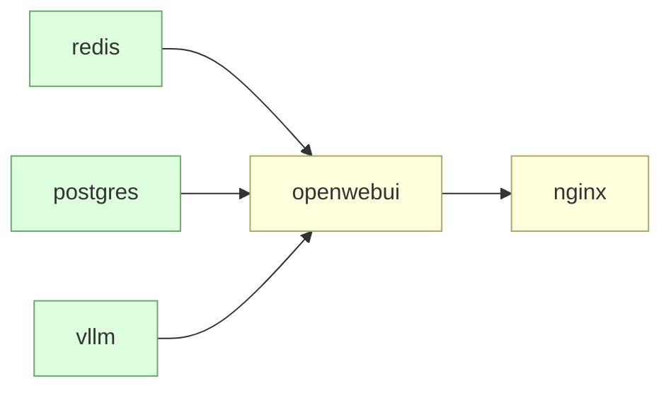

# Architecture

This document describes the full architecture of the air-gapped LLM stack — what each component does, how they communicate, and why the layout is designed the way it is.

---

## High-Level Component View



**Key properties:**

- Only Nginx is reachable from outside the host (ports 80/443).
- The `backend` Docker network is declared `internal: true`, so the inference and database tier cannot egress even if compromised.
- Every persistent volume lives on the dedicated data-tier RAID 10, never on the OS partition.
- Active Directory is the only external corporate dependency once deployment is complete.

---

## Storage Architecture

Two completely separate storage tiers, each optimized for its role.

```mermaid
flowchart LR
    subgraph BootTier["Boot Tier — Hardware RAID 1"]
        B1[M.2 SATA SSD 240GB]
        B2[M.2 SATA SSD 240GB]
        BOSS[Dell BOSS-S1<br/>hardware RAID controller]
        B1 --> BOSS
        B2 --> BOSS
        BOSS --> OS[/dev/sda<br/>~240GB virtual disk]
        OS --> EFI[1G EFI]
        OS --> BT[2G /boot]
        OS --> SW[32G swap]
        OS --> RT[~205G /]
    end

    subgraph DataTier["Data Tier — Software RAID 10 + LVM"]
        D1[SAS SSD 750G]
        D2[SAS SSD 750G]
        D3[SAS SSD 750G]
        D4[SAS SSD 750G]
        D5[SAS SSD 750G]
        D6[SAS SSD 750G]
        HBA[HBA330<br/>IT mode pass-through]
        D1 --> HBA
        D2 --> HBA
        D3 --> HBA
        D4 --> HBA
        D5 --> HBA
        D6 --> HBA
        HBA --> MD[/dev/md0<br/>RAID 10, 2.25TB]
        MD --> VG[vg_data<br/>LVM volume group]
        VG --> LV1[lv_models 600G]
        VG --> LV2[lv_owui 400G]
        VG --> LV3[lv_docker 300G]
        VG --> LV4[lv_backup 800G]
    end
```

**Design rationale:**

| Decision | Why |
|---|---|
| Hardware RAID 1 on BOSS for OS | iDRAC monitors out-of-band; replacement requires zero OS intervention |
| Software RAID 10 on HBA330 for data | mdadm is auditable, recoverable, and not tied to firmware lifecycle |
| LVM on top of mdadm | Online expansion, snapshot-based pre-upgrade rollback |
| Separate `lv_docker` | Docker pull bloat cannot fill the OS partition |
| `noatime` mount option | Reduces SSD wear; access time is irrelevant for this workload |
| 5% reserved blocks tuned to 0–1% | Reclaims tens of GB on large LVs without sacrificing fsck headroom |

---

## Inference Path

End-to-end flow of a single chat message:



**Latency notes:**

- Token streaming starts in **< 500 ms** for warm prompts; the first token round-trip is dominated by the prefill phase, not network or proxy.
- `proxy_buffering off` in nginx is **non-negotiable** — without it, tokens arrive in chunks and the UX feels broken.
- Open WebUI persists each turn to PostgreSQL synchronously, providing a complete audit trail without measurable user-visible overhead.

---

## Network Boundary



The host has two distinct lifecycle phases:

1. **Online staging** — temporary internet access for `apt`, `docker pull`, `hf download`. Asset hashes are recorded.
2. **Air-gapped production** — moved to the isolated VLAN. NTP and DNS pivot to internal services. Any outbound packet is a misconfiguration alert.

---

## Service Dependency Graph

`docker compose` enforces the following healthcheck-gated startup order:



- `vllm` is the slowest to become healthy (~30 s cold-start) — its `start_period: 600s` healthcheck window absorbs cold-start variance gracefully.
- `openwebui` will not start until both `vllm` and `postgres` report healthy, eliminating the entire class of "Open WebUI shows 'no models'" race conditions.
- `nginx` starts last, so the moment the user can reach the site, the backend is already serving.

---

## Failure Modes and Recovery

| Failure | Detection | Recovery Path |
|---|---|---|
| Single SAS SSD in RAID 10 dies | mdadm email + iDRAC alert | Hot-swap, `mdadm --add`, ~60 min resync |
| BOSS M.2 SSD dies | iDRAC alert | Hot-swap, hardware controller rebuilds RAID 1 automatically |
| GPU dies | `nvidia-smi` reports DEGRADED | Reduce `--tensor-parallel-size` to 1, fall back to single-GPU model |
| vLLM container crashes | Compose `restart: unless-stopped` | Auto-restart; check logs |
| PostgreSQL data corruption | Healthcheck fail | Restore from latest `pg_dump` in `/opt/ai/backup/daily/` |
| Whole host dies | External monitoring alert | Reinstall from BOSS RAID 1 mirror, restore data tier from backup volume / NAS |
| AD outage | Login fails | Pre-staged break-glass local admin account |

Every failure mode has a documented manual recovery path. There is no implicit assumption of cloud-side restoration.
